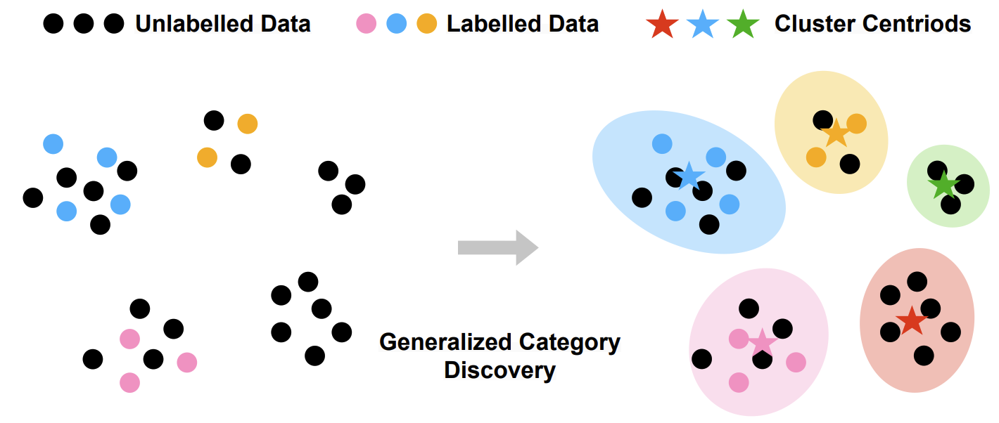
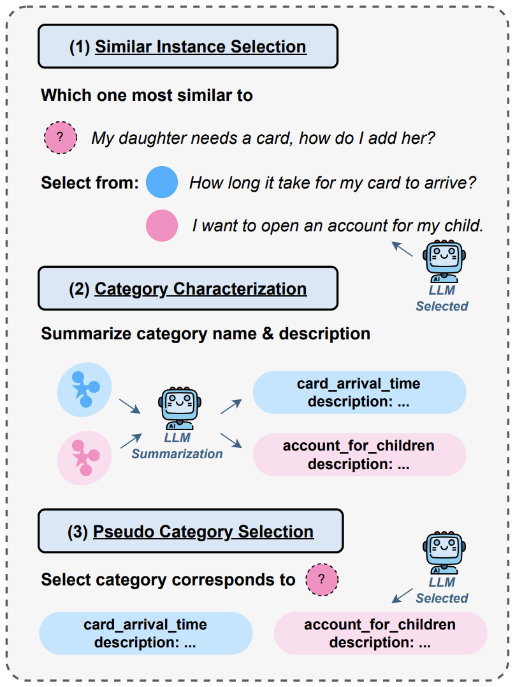

# GLEAN: Generalized Category Discovery with Diverse and Quality-Enhanced LLM Feedback


This repository contains the implementation of the paper:
> **GLEAN: Generalized Category Discovery with Diverse and Quality-Enhanced LLM Feedback** 
> [[Paper]](https://arxiv.org/abs/2502.18414) <br>
> Henry Peng Zou, Siffi Singh, Yi Nian, Jianfeng He, Jason Cai, Saab Mansour, Hang Su
 <br>


<!-- ## Generalized Category Discovery (GCD)

Generalized Category Discovery aims to automatically categorize unlabeled data by leveraging the information from a limited number of labeled data from known categories, while the unlabeled data may come from both known and novel categories. -->


<!-- ## GLEAN Pipeline


Pipeline of GLEAN. Both labeled and unlabeled data are first forwarded to a text encoder/backbone to extract features for k-means clustering. Then we compute entropy and select instances with high entropy as ambiguous data to obtain LLM feedback for further refinement. Specifically, we query LLM to (1) select similar instances, (2) generate category descriptions and (3) assign pseudo categories to ambiguous data. Lastly, the three diverse feedback types are leveraged for model training via neighborhood contrastive learning and pseudo category alignment. During inference, we only utilize the text encoder and obtain final results via K-Means clustering on the extracted features. -->


<!-- ## LLM Feedback
Illustration of three different types of LLM feedback utilized in GLEAN.
 -->


## Setup
```bash
conda create -n glean python=3.9 -y
conda activate glean

# install pytorch
conda install pytorch==2.1.0 torchvision==0.16.0 torchaudio==2.1.0 pytorch-cuda=12.1 -c pytorch -c nvidia


# install dependency
pip install -r requirements.txt
pip install faiss-gpu==1.7.2 --no-cache-dir
```
To reproduce our paper results, make sure that you have the following package version installed:
transformers==4.15.0, pytorch==2.1.0, 2.1.1 or 2.1.2, as we found that model performance may vary across different package versions, particularly with the transformers package.


## Running
First, add you OpenAI API key in line 58 of the 'run.sh' file.

Pre-training, training and testing our model through the bash script:
```bash
sh run.sh
```
You can also add or change parameters in run.sh (More parameters are listed in init_parameter.py)


## Checkpoints
You can download model checkpoints from [checkpoints](https://huggingface.co/TreeForest/GCDLLM/tree/main), for example:

```bash
mkdir -p /intern/users/henry/gcdllm/GCDLLM/checkpoint_dir 

wget -P ./checkpoint_dir/ https://huggingface.co/TreeForest/GCDLLM/resolve/main/model_clinc/clinc_known_cls_ratio_0.25_labeled_ratio_0.1_weight_cluster_instance_cl_0.05_evaluation_epoch_24.pt

```
You can reevaluate this checkpoint through the bash script:

```bash
bash run_reevaluate.sh ./model_clinc/clinc_known_cls_ratio_0.25_labeled_ratio_0.1_weight_cluster_instance_cl_0.05_evaluation_epoch_24.pt 
```


## Bugs or Questions

If you have any questions related to the code or the project, feel free to email Henry Peng Zou ([pzou3@uic.edu](pzou3@uic.edu), [penzou@amazon.com](penzou@amazon.com)). If you encounter any problems when using the code, or want to report a bug, please also feel free to reach out to us. Please try to specify the problem with details so we can help you better and quicker!

## Acknowledgement
This repo borrows some data and codes from [Loop](https://github.com/Lackel/LOOP) and [JointMatch](https://github.com/HenryPengZou/JointMatch). We appreciate their great works!